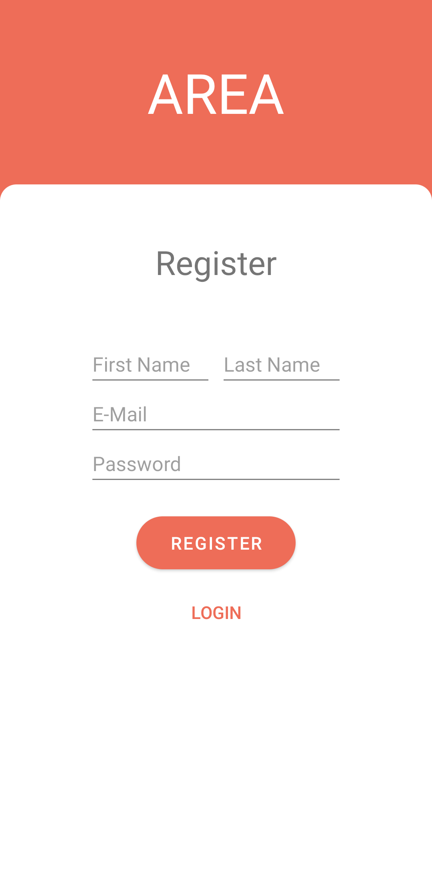
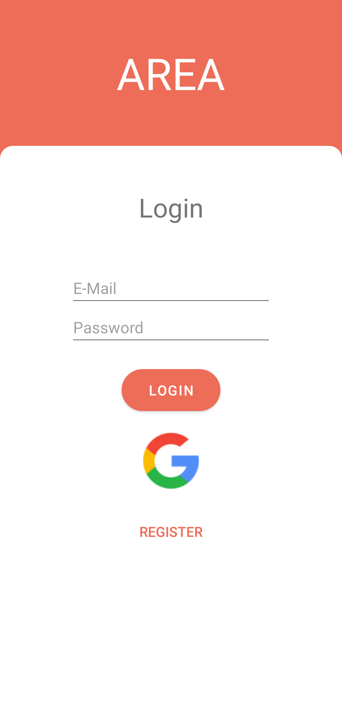
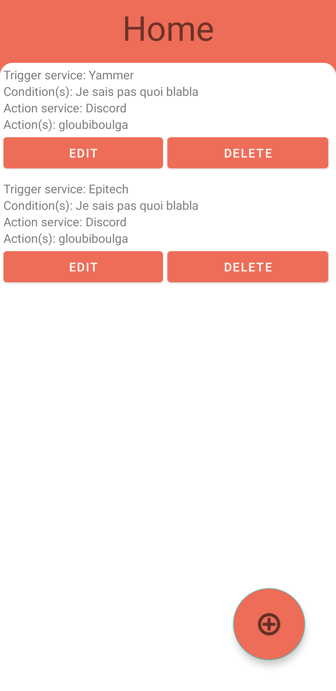
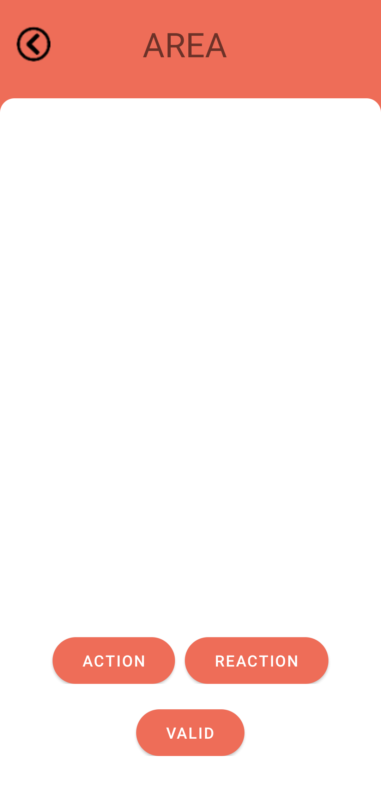
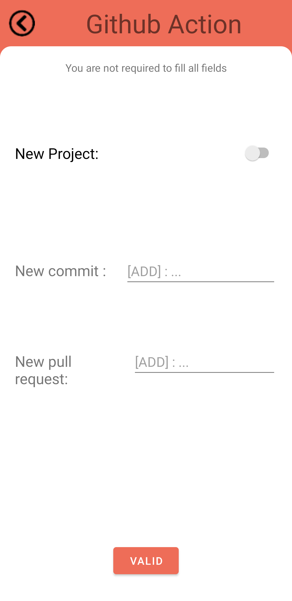
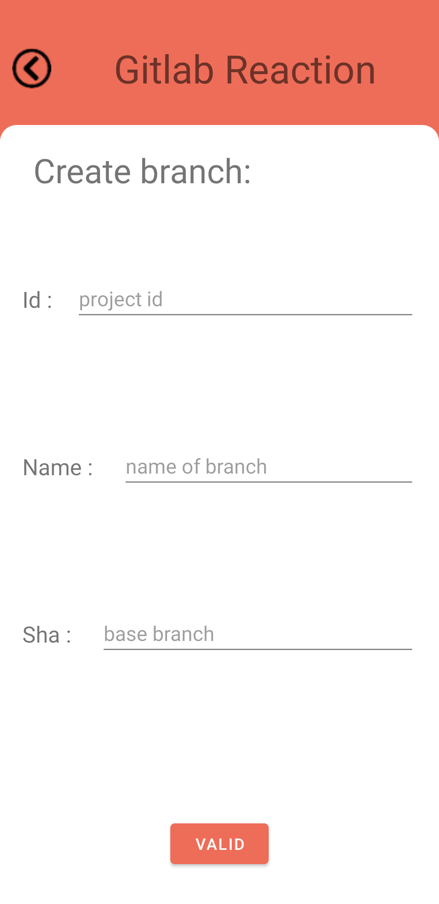

# Client Mobile

## Requirement

For developers :
* Android Studio: [click here](https://developer.android.com/studio?hl=fr)

For everybody :
* Docker
* Docker-compose
* Emulator

## Run

For developers :
Once Android Studio opened in the right folder, you can click on 'run project' after choosing a device.

In the root directory, please write the following commands :
```sh
docker-compose build && docker-compose up --force-recreate
```

## Usage

* Once the application opened, you have to create an account. Please fill the different fields and then click on the register button.

<p align="center">
  
</p>

* Once done, you can click on the login button. You'll be redirected to the login page. You can login with your AREA account or with your google account by clicking on the logo.

<p align="center">
  
</p>

* You are now on the Home page. Click on the plus button to add a new AREA.

<p align="center">
  
</p>

* You'll reach this screen, you can click on the action button to add an action.

<p align="center">
  
</p>

* You have to choose one service as an action author, you are requiered to connect to your account in your choosen service. For an exemple, we will choose github.

<p align="center">
  
</p>

* Once being connected, you have to fill out a form the way you want. You are not requiered to fill out all fields. Then, click on the valid button.

<p align="center">
  
</p>

Now, you need a reaction. Click on the reaction button and choose your service. For the exemple, we'll choose gitlab.

<p align="center">
  
</p>

* Now you have to fill out all fields before click on the valod button.

<p align="center">
  
</p>

* After that you can add as much AREA as you want. Once clicked on the valid button, you will be on the home screen with your AREA. You can delete it by clicking on the delete button.

<p align="center">
  
</p>
